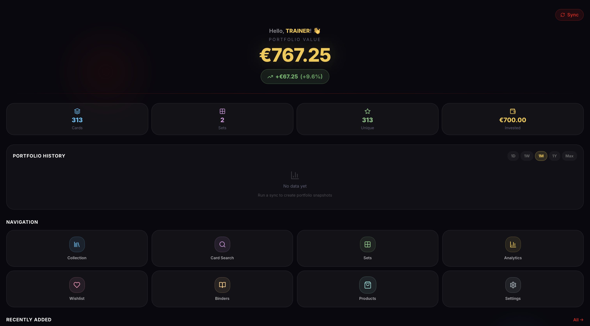

# ⚠️ Disclaimer
Everything below (and in this repo) is unapologetically vibecoded.
Expect vibes, not guarantees. Proceed with good humor and version control.  

Contributions are welcome. Open a pull request for fixes, features, or docs. Not sure where to start? Open an issue and we'll chat. Small improvements are great.

Found a bug or have an idea? Open an issue. Include steps to reproduce, expected vs. actual behavior. Screenshots or logs help.

Fork, branch, and submit a focused PR. Add or update tests and docs as needed. Explain the "why" and link related issues. Make sure checks pass.

Be kind. Be clear. Assume good intent. Keep feedback constructive.

# 🃏 PokéCollector

> A self-hosted, full-stack Pokémon TCG collection management app — track your cards, monitor prices, manage binders, and analyse your portfolio.

    


---

## 📑 Table of Contents

- [Features](#-features)
- [Quick Start](#-quick-start)
- [Environment Variables](#-environment-variables)
- [Architecture](#️-architecture)
- [Tech Stack](#️-tech-stack)
- [Documentation](#-documentation)
- [Configuration Reference](#-configuration-reference)
- [Updating](#-updating)
- [Support](#️-support)
- [License](#-license)

---

## ✨ Features

### 📦 Collection Management
- Add cards with **quantity**, **condition** (Mint / NM / LP / MP / HP), **variant** (Holo, Reverse Holo, First Edition, Alt Art, etc.), and **purchase price**
- Track **German and English** card versions separately
- Manually create custom cards not in TCGdex

### 🔍 Card Search
- Search all cards cached in your local database by name, set, type, rarity, HP, artist
- Short-code search: type `PFL 001` to find card #1 from Paldea Fates directly
- Language filter: show DE only, EN only, or both
- Scan a card with your camera for AI-powered recognition (requires Google Gemini API key)

### 🗂️ Set Checklists
- Browse all Pokémon TCG sets with logo, series, total cards, and your completion %
- Per-set checklist: green = owned, red/grey = missing
- Supports both German and English set versions

### 📈 Price Tracking & Portfolio
- **Cardmarket EUR** prices (non-holo + holo variants): market, low, trend, avg1, avg7, avg30
- **TCGPlayer USD** prices: normal, reverse holo, holo market prices
- Daily price history with line charts per card
- Portfolio value over time chart on the dashboard
- Configurable **primary price** for value calculations (Settings → Primary Price)

### 📊 Analytics
- Top 10 most valuable cards in your collection
- Duplicate cards (owned > 1 copy) sorted by total value
- Top price movers in the last 1–30 days
- Rarity distribution breakdown
- Investment tracker: cost vs. current value over time

### 🛍️ Products (Sealed)
- Track sealed product purchases (booster boxes, ETBs, etc.)
- Record purchase price, current value, sold price
- Realized P&L on sold products shown on the dashboard

### 💚 Wishlist
- Save cards you want to acquire
- Set price alerts (above / below threshold) with **Telegram notifications**

### 📖 Binders
- Organise cards into virtual binders
- Collection binder type: only shows cards you own
- Checklist binder type: shows all cards, highlights owned ones

### 👤 Single-User & Multi-User Mode
- **Single-user mode** (default): no login required, auto-authenticates as admin
- **Multi-user mode**: enable in Settings → toggle requires admin privileges
  - Multiple user accounts with JWT authentication
  - Admin and Trainer roles
  - Per-user collections, wishlists, and portfolio tracking
  - Animated Pokémon avatar selection (Gen 1 sprites)
  - Auto-detected if more than one user exists

### 🏆 Social Features (Multi-User only)
- **Trainer Leaderboard**: ranked by portfolio value, cards, P&L
- **Trainer Comparison**: side-by-side stats, card overlap, trade suggestions
- **Achievements**: 20 badges (PokeAPI gym badge sprites) with progress tracking

### 🎨 Themes
- 9 Pokémon-type color themes (Default, Fire, Water, Grass, Electric, Psychic, Dragon, Dark, Fairy)
- Instant switch, stored per device

### 🖼️ Image Cache
- All card and set images proxied through the backend
- Lazy caching in PostgreSQL (fetched on first view, served from DB after)
- Works offline for previously viewed cards

### ⚙️ Settings & Utilities
- **Language**: German / English UI
- **Primary Price**: choose which Cardmarket price drives your portfolio value
- **Currency**: EUR or USD (live exchange rate via Frankfurter API)
- **Profile**: change username and avatar
- **Export**: CSV or PDF of your full collection
- **Backup / Restore**: full PostgreSQL dump and restore
- **Sync**: manual trigger or automatic (configurable interval)

---

## 🚀 Quick Start

### Prerequisites
- [Docker](https://docs.docker.com/get-docker/) + [Docker Compose](https://docs.docker.com/compose/)
- Alternatively: download the code as ZIP from the [GitHub repo](https://github.com/Git-Romer/pokecollector) (green "Code" button → "Download ZIP")

### 1. Clone & Configure

```bash
git clone https://github.com/Git-Romer/pokecollector.git
cd pokecollector
```

Create a `.env` file in the project root:

```env
# Required
POSTGRES_PASSWORD=your_secure_password

# Recommended — keeps users logged in across container restarts
JWT_SECRET_KEY=some_long_random_string

# Optional — Telegram notifications for price alerts
TELEGRAM_BOT_TOKEN=your_bot_token
TELEGRAM_CHAT_ID=your_chat_id

# Optional — AI card recognition (Google Gemini)
GEMINI_API_KEY=your_gemini_key

# Optional — customise the auto-created admin account
ADMIN_USERNAME=admin
ADMIN_PASSWORD=your_admin_password
```

> **Note:** No TCGdex API key required — it's a free, open API.

### 2. Start

```bash
docker compose up -d
```

First launch takes 2–5 minutes while Docker downloads images and builds the app.

### 3. Open

| Service | URL |
|---------|-----|
| App | http://localhost:3000 |
| API docs | http://localhost:8000/docs |

> Running on a different machine (e.g. a Raspberry Pi)? Use its IP address instead: `http://<ip>:3000`

### 4. First Sync

On first launch the app is empty. Click the 🔄 sync button on the home screen to fetch all sets and cards from TCGdex. This takes 1–3 minutes.

### 5. Login

On first start, an admin account is automatically created:
- **Username**: `admin` (or whatever you set in `ADMIN_USERNAME`)
- **Password**: check the backend logs (`docker compose logs backend`) or set it via `ADMIN_PASSWORD` in `.env`
- In **single-user mode** (default), no login is required

---

## 🔧 Environment Variables

### Required

| Variable | Description | Default |
|----------|-------------|---------|
| `POSTGRES_PASSWORD` | PostgreSQL database password | `changeme` |

### Recommended

| Variable | Description | Default |
|----------|-------------|---------|
| `JWT_SECRET_KEY` | Secret for signing JWT tokens. If not set, a random key is generated on each restart — **all users will be logged out** when the container restarts. | Random per restart |

### Optional

| Variable | Description | Default |
|----------|-------------|---------|
| `TELEGRAM_BOT_TOKEN` | Telegram bot token for price alert notifications | *(empty)* |
| `TELEGRAM_CHAT_ID` | Telegram chat ID for notifications | *(empty)* |
| `GEMINI_API_KEY` | Google Gemini API key for AI card scanner (can also be set in Settings UI) | *(empty)* |
| `ADMIN_USERNAME` | Username for the auto-created admin account | `admin` |
| `ADMIN_PASSWORD` | Password for the admin account. If not set, a random password is generated and printed to the backend logs. | Random (logged) |
| `ADMIN_BOOTSTRAP_LOG` | Whether to log admin credentials on first start | `true` |

---

## 🏗️ Architecture

```
pokecollector/
├── backend/         # Python FastAPI + PostgreSQL
│   ├── api/         # Route handlers (auth, cards, collection, analytics, social, …)
│   ├── services/    # TCGdex client, sync logic, scheduler, notifications, auth
│   ├── models.py    # SQLAlchemy ORM
│   ├── schemas.py   # Pydantic schemas
│   └── database.py  # DB engine + idempotent migrations
├── frontend/        # React 18 + Vite + Tailwind CSS
│   ├── src/
│   │   ├── pages/       # Route pages (HomeScreen, Collection, Analytics, …)
│   │   ├── components/  # Reusable components (AppNav, TabNav, PokeBallLoader, …)
│   │   ├── contexts/    # AuthContext, SettingsContext
│   │   ├── hooks/       # useTheme, …
│   │   ├── i18n/        # German + English translations
│   │   └── api/         # Axios client
│   └── nginx.conf       # Reverse proxy (serves frontend + proxies /api/ to backend)
└── docker-compose.yml
```

The frontend is served by **Nginx** which also acts as a reverse proxy — all `/api/` requests are forwarded to the FastAPI backend. This means the app only needs **one URL** (port 3000) for both frontend and API.

See [`docs/ARCHITECTURE.md`](docs/ARCHITECTURE.md) for the full deep-dive.

---

## 🛠️ Tech Stack

| Layer | Technology |
|-------|-----------|
| Frontend | React 18, Vite, Tailwind CSS, TanStack Query, Recharts, Lucide Icons |
| Backend | Python 3.11, FastAPI, SQLAlchemy, APScheduler, Pydantic |
| Database | PostgreSQL 15 |
| Card Data | [TCGdex](https://tcgdex.dev/) — free, no API key |
| Prices | Cardmarket EUR + TCGPlayer USD (via TCGdex pricing) |
| AI Scanner | Google Gemini 2.5 Flash (optional) |
| Deploy | Docker + Docker Compose |

---

## 📚 Documentation

| Doc | Description |
|-----|-------------|
| [`docs/ARCHITECTURE.md`](docs/ARCHITECTURE.md) | System architecture, data flow, ID model |
| [`docs/BACKEND.md`](docs/BACKEND.md) | API routes, models, migration guide |
| [`docs/FRONTEND.md`](docs/FRONTEND.md) | Pages, components, styling, i18n |

---

## 🔧 Configuration Reference

All settings are persisted in the database and editable via the Settings page:

| Setting | Default | Options |
|---------|---------|---------|
| Language | `de` | `de`, `en` |
| Primary Price | `trend` | `trend`, `avg1`, `avg7`, `avg30`, `low`, `market` |
| Currency | `EUR` | `EUR`, `USD` |
| Multi-User Mode | `off` | Toggle in Settings (admin only) |
| Theme | Default | Default, Fire, Water, Grass, Electric, Psychic, Dragon, Dark, Fairy |
| Auto-sync interval | 30 min | Configurable |
| Full sync interval | 5 days | Configurable |

---

## 🔄 Updating

> ⚠️ **Back up your database before updating!** You can do this either through the app (Settings → Backup) or via Docker:
> ```bash
> docker compose exec postgres pg_dump -U pokemon pokemon_tcg > backup_$(date +%Y%m%d).sql
> ```

To update to the latest version:

```bash
cd pokecollector
git pull
docker compose up -d --build
```

Database migrations run automatically on startup — no manual steps needed.

---

## ❤️ Support

All sponsorship earnings are donated to animal rescue organizations. 🐾

If you enjoy PokéCollector, consider [sponsoring the project](https://github.com/sponsors/Git-Romer) — every contribution goes directly to helping animals in need.

---

## 📝 License

[GNU AGPLv3](LICENSE)
